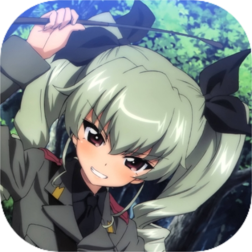
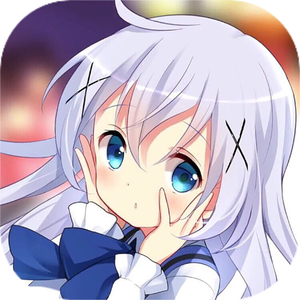
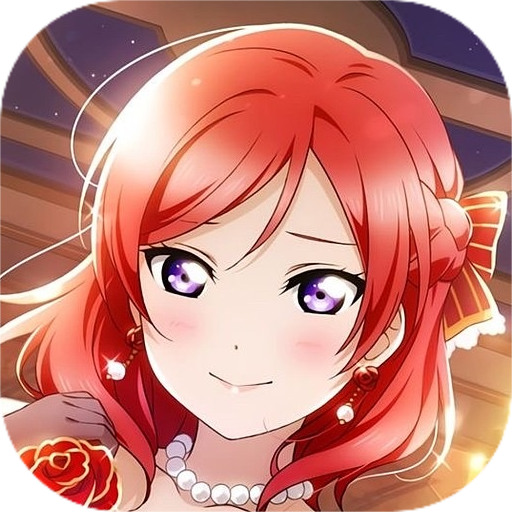
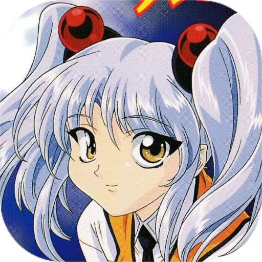
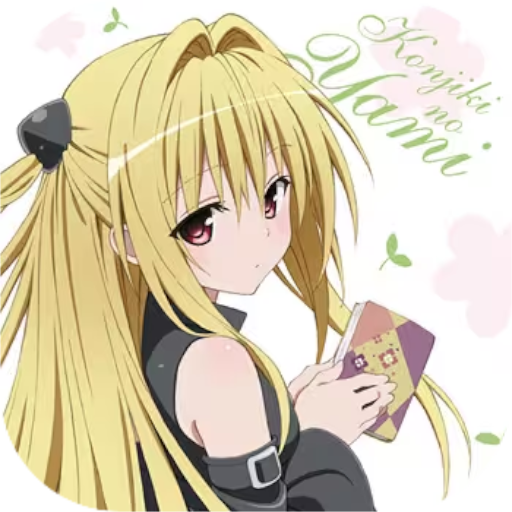
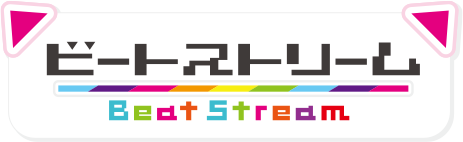
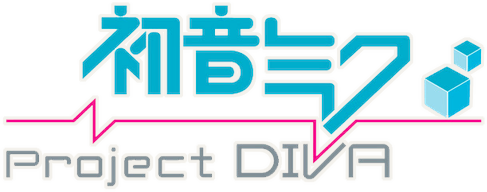

<h1>🌟 𝑴𝒂𝒚𝒃𝒆𝟱𝟭𝟱'𝒔 𝑺𝒆𝒍𝒇-𝑰𝒏𝒕𝒓𝒐𝒅𝒖𝒄𝒕𝒊𝒐𝒏𝒔 🌟</h1>

<b>Update since　2024.04.16</b>

<!--

  You're not Japanese? 
  Don't worry. I translated a my profile from Japananese into English. 
  Let's check it out! 
  🔗[Self-Introductions_en.md](Self-Introductions_en.md)

 
-->

### プロフィール 👤　- About Me -
あちこち出かけたり、ゲームしてたり、たまに絵を描いてたりします。
 

### 活動先リンク 🌐　- Connect with me -
- リンク先は 🔗[こちら](https://potofu.me/maybe515) にまとめてあります。
- GitHubのプロフィールは 🔗[こちら](https://github.com/Maybe515)
 

## コテハン由来 🖋　- My handle name comes from -

※某エロゲブランドとは関係ありません。

'08年に発売された 🔗[**アキバ系飲料「めいびぃ！」**](https://gigazine.net/news/20080817_sukumizu_meibi/) から。 
空き瓶を探しています。未だに見つかってません。情報求厶… 

 

<!--
## 座右の銘　- Motto -

<a href="https://hoyme.jp/shindan/86849/results/983">水滴石穿</a>（すいてきせきせん）

 
-->

## 趣味 🎾　- Enjoying Play, Into it, Hobbies -
<!-- 現在のブームだけに絞る。他は"経験済み"項目を追加して記入する。 -->

  <b>- Indoor -</b> 
  ゲーム　お絵かき　音楽鑑賞　映画鑑賞　料理　ファッション　カラオケ

  <b>- Outdoor -</b> 
  旅行　温泉　トレッキング　山登り　キャンプ　カフェ巡り　神社・お寺巡り　写真撮影

  <b>- Sports -</b> 
  スノボ　ダンス　ゴルフ　バスケ　サッカー　バレー　バドミントン　インディアカ　ヨガ

  <b>- Collections -</b> 
  古銭集め　御朱印集め　御船印集め　ICカード集め　切符・硬券収集

  <b>- Mania -</b> 
  車　鉄道(乗り鉄, 撮り鉄)　ミリタリー(銃, 艦体)　競馬鑑賞　F1・ラリー鑑賞

 

## 好きなもの ⭐　- Like it -

  <b>- Foods & Drinks -</b> 
  スイーツ全般　紅茶　コーヒー　日本酒

  <b>- Others -</b> 
  腕時計　コーギー　植物

 

## 推しているもの 💗　- FAV. -
### 作品　- Anime, Comics, Novels -
<!--
タイトルロゴを並べる。公式HPへ飛ばす。

-->

  
好きな作品

  <ul>
    <li>AngelBeats!</li>
    <li>アイマス(765)</li>
    <li>インフィニットストラトス</li>
    <li>宇宙戦艦ヤマト</li>
    <li>うる星やつら</li>
    <li>機動戦艦ナデシコ</li>
    <li>境界の彼方</li>
    <li>ごちうさ</li>
    <li>シティーハンター</li>
    <li>葬送のフリーレン</li>
    <li>美少女戦士セーラームーン</li>
    <li>まどマギ</li>
    <li>まもって守護月天!</li>
    <li>八十亀ちゃん</li>
    <li>らき☆すた</li>
    <li>初期ラ！</li>
  </ul>

 

### キャラクター　- My wife -
**- Anime, Manga -**  

<!--
キャラアイコンを自作して並べる。キャラ紹介ページへ飛ばす。

  
**- Game -**   

-->

  
ゲーム

  <ul>
    <li>【アイマス】ゆきぽ</li>
    <li>【GF(仮)】むつみん</li>
    <li>【東方】おぜうさま、妹様</li>
    <li>【艦これ】響、瑞鳳、瑞鶴</li>
    <li>【プリコネ】サレン、ネネカ</li>
    <li>【バトガ】あんこ</li>
    <li>【シャニマス】冬優子、円香</li>
    <li>【ウマ娘】タキオン、カフェ、ダスカ、タイシン</li>
    <li>【ブルアカ】ネル, ヒナ、イオリ、ウイ</li>
    <li>【千恋＊万花】ムラサメちゃん</li>
    <li>【ﾀﾞｰｸｸﾛﾆｸﾙ】モニカ</li>
    <li>【サルゲッチュ】チャル</li>
    <li>【ブルリフ】きらら、なーな、ユズ</li>
  </ul>

 

### 絵師さん　- Illustrators -
|Name|Since|FANBOX|
:-:|:-:|:-:
|**茉宮祈芹** |2018年|2020.10.03|
|**天川さっこ** |2017年|2019.06.26|
|**あづみ一樹** |2016年|2021.01.08|
|**白もち桜** |2015年|-|
|**おもちもなか** |2021年|-|
|**ひづき夜宵** |2019年|-|
|**muku** |2019年|-|
 

### 声優さん　- Voice Actors -
|Name|Since|FANCLUB|
:-:|:-:|:-:
|**田口宏子**|2006年|-|
|**野中藍**|2006年|-|
|**川上とも子**|2006年|-|
|**堀江由衣**|2013年|**【黒ネコ同盟】** 2020.06.26 (No.14880)|
 

### 歌手・グループ　- Singers & Groups -
|Name|Since|FANCLUB|
:-:|:-:|:-:
|**ave;new**|2008年|-|
|**ガゼル（やなぎなぎ）**|2008年|-|
|**Queen**|2014年|-|
|**三代目 J Soul Brothers from EXILE TRIBE**|2015年|**【EX Family】** 2017.07.14 (No.1114564)  **【mate】** 2022.11.02 (No.JSB0023720)|
 

### 配信者さん　- Live Streamers -
<!-- YouTubeのリンク先を追加して飛べるようにする -->
|Name|Since|Member ship|
:-:|:-:|:-:
|**兄者弟者** |2010年|-|
|**如月ささら** |2023年|2023.03.01|
 

<!--
## イラスト活動　- Illustrations -

Drawed since 2007

-->

## 音ゲー 🎹　- Rhythm Games -
<!-- 機種セルにタイトルロゴを追加する＋公式HPへ飛べるようにする -->
### - Arcade -
**Started since　2008.08.17**  
- 🔗[音ゲーまとめ](https://docs.google.com/spreadsheets/d/1Ma2HGvr2WH0oBMPS-Nf0WbsOgIvLGiqPT04ecaEQ5n8/edit?usp=sharing)  
 
<caption>▼メインでプレイしている筐体</caption>

|Title|Version|Since|Ability|
:-:|:-:|:-:|:-:
||saucer|2013.10.13|-|
||Ⅱ -infinite infection-|2014.04.27|VF 8.453|
||SPADA|2014.04.27|-|
||無印|2014.10.23|Rank6|
||無印|2015.12.10|max16.32|
||無印|2018.08.11|max9.62|
||無印|2023.05.12|max5229.47|
 

<caption>▼その他、過去にプレイした筐体</caption>

|Title|Version|Since|
:-:|:-:|:-:
||16 PARTY♪|2008.08.17|
||11|2008.??.??|
||groovin'!!|2014.10.23|
||Future Tone|2014.10.23|
||EX|2014.12.05|
||OverDrive|2014.??.??|
||2013|2014.??.??|
||-|2015.??.??|
||無印|2016.02.14|
||無印|2016.03.16|
||PiNK|2016.05.20|
||無印|2017.03.13|
||無印|2023.07.05|
||無印|2024.03.22|
||無印|2024.04.06|
 

### - PC, Consumer -
|Title|Playing environment|Ability|
:-:|:-:|:-:
|**BMS**|専コン|beatmaniaと同様|
|**k-shoot MANIA**|キーボード|Lv14：AAクリア|
|**Step Mania 5**|キーボード|Lv11：AAクリア|
|**DJMAX RESPECT Ⅴ**|キーボード|
【4B】Lv15：S　SC13：A 【5B】- 【6B】Lv15：A 【8B】Lv9：S　Lv11：A
|		
 

## 家庭用ゲーム 🎮　- CS Games -
<!-- 好きな作品だけ記載して、プレイ済み等はスプレッドシートにまとめる -->

  
好きなタイトル・やりこんだタイトル

  <ul>
    <li>スーパーメトロイド（SFC）</li>
    <li>ゼルダの伝説 神トラ（SFC）</li>
    <li>サルゲッチュ（PS）</li>
    <li>moon（PS）</li>
    <li>ジャック×ダクスター 旧世界の遺産（PS2）</li>
    <li>ダーククロニクル（PS2）</li>
    <li>KH1（PS2）</li>
    <li>KH2（PS2）</li>
    <li>MGS3（PS2）</li>
    <li>MHP2ndG（PSP）</li>
    <li>MGS PW（PSP）</li>
    <li>ポケモンDP（NDS）</li>
    <li>街森（Wii）</li>
    <li>MH3（Wii）</li>
    <li>とび森（3DS）</li>
  </ul>

<!--

  <b>- FC -</b> 
  海腹川背　忍者龍剣伝　メトロイド

  <b>- SFC -</b> 
  神トラ　スーパーメトロイド　セプテントリオン　かまいたちの夜　ときメモ　トワイライトシンドローム　風来のシレン　プリペル　マリオワールド

  <b>- PS -</b> 
  I.Q　MGS　moon　クロノトリガー　サルゲッチュ　ポポロクロイス物語　ロックマンDASH1,2

  <b>- N64 -</b> 
  時オカ　マリオ64　ムジュラ

  <b>- PS2 -</b> 
  Jak1,2　KH1,2　MGS2,3　ToS　サルゲッチュ2,3　ダーククラウド　ダーククロニクル　ピポサル2001　

  <b>- GC -</b> 
  風タク　トワプリ　マリオサンシャイン

  <b>- PSP -</b> 
  MGSPW　MHP2G,3rd

  <b>- NDS -</b> 
  おい森　ポケモンDP

  <b>- Wii -</b> 
  MH3　街森　マリオギャラクシー1,2

  <b>- 3DS -</b> 
  とび森

  <b>- PS4 -</b> 
  KH3　NieR:Automata

-->
 
  
## アプリゲー 📱　- App Games -
<caption>▼現在プレイ中のタイトル</caption>

|Title|UserID|Since|
:-:|:-:|:-:
|**ブルリフS**|425824573|2023.02.21|
|**駅メモ**|XBGYCS2121|2021.10.04|
 
<caption>▼過疎っているタイトル</caption>

|Title|UserID (Main)|UserID (Sub)|
:-:|:-:|:-:
|**パズドラ**|161461878|-|
|**白猫**|CEJHWK2R4|-|
|**放置少女**|53077|-|
|**プリコネR**|886784051|456423834|
|**ブルアカ**|BFXRQCVQ|ASCVBOLR|
|**NieR**|182075368914|-|
|**ウマ娘**|189849910|-|
|**ヘブバン**|-|-|
|**Nikke**|73254891|-|
|**崩壊スターレイル**|802967539|-|
 

## ソシャゲ 💻　- Social Games -
- GF(仮)　🔗[Account](http://vcard.ameba.jp/profile?userId=4374025)  
- グラブル　🔗[Account](http://gbf.game.mbga.jp/#profile/18259066)  
 

## RTA 🏆　- Speedrun -
- speedrun.com　🔗[Account](https://www.speedrun.com/user/Maybe515/)
 
<caption>▼申請していない非公式記録</caption>

|Title (Region) / Hard|Category|Time|Date|
:-:|:-:|:-:|:-:
|**Jak1 (JP) / PCSX2**|100%|3h 11m 27s|'23/03/12 02:40|
|**Jak1 (JP) / PCSX2**|Any%|21m 19s|'23/03/19 02:47|
 

## 美少女ゲーム 🖥　- Eroge & Galge -
- エロゲー批評空間　🔗[Account](https://erogamescape.dyndns.org/~ap2/ero/toukei_kaiseki/user_infomation.php?user=Maybe515)
 
<table>
  <tbody>
    <tr>
      <th>Items</th>
      <th>Eroge</th>
      <th>Galge</th>
    </tr>
    <tr>
      <th>プレイ開始日</th>
      <td>2016.07.19</td>
      <td>2006.03.??</td>
    </tr>
    <tr>
      <th>初プレイ作品</th>
      <td>フレラバ ～Friend to Lover～</td>
      <td>ときめきメモリアル 伝説の樹の下で【SFC版】</td>
    </tr>
    <tr>
      <th>推しブランド</th>
      <td>FAVORITE, Littlewitch, Key</td>
      <td align="center" rowspan="3">-</td>
    </tr>
    <tr>
      <th>推しジャンル</th>
      <td>シナリオ、泣き</td>
    </tr>
    <tr>
      <th>好きな作品</th>
      <td>AIR　白詰草話　こなかな　さくら、もゆ。</td>
    </tr>    
  </tbody>
</table>
 

## 旅行 🚋　- Travels -
- 🔗[経県値マップ 都道府県版](https://uub.jp/j.cgi/FjwTajqshcjrcjwTtIejuirzx/)
  

## 温泉 ♨　- Hot Spring -
- 🔗[今までに訪れた温泉郷](https://docs.google.com/spreadsheets/d/1HOwSPnFU1QsNKauJLwPIBWJkH0LweD06ugUI83Swp6Q/edit#gid=2084208021)
  

### 温泉むすめ　- Onsen Musume -
**Started since　2021.06.05**  
- 🔗[ぽか活まとめ](https://docs.google.com/spreadsheets/d/1c5t1TK_eI5YYEG4iGHZ9_nLYOHqmqSnArYPG8Ljjqes/edit?usp=sharing)
  
  
**- 推しむすめ -**  

<!--

mutsumi.png
yukiho.png
cafe.png
scarlet.png
tachyon.png
taishin.png
hibiki.png
zuiho.png
zuikaku.png
kuro.png
chall.png
fuyuko.png
madoka.png
murasame.png
monica.png
flandre.png
remilia.png
anko.png
neneka.png
saren.png
hina.png
iori.png
neru.png
ui.png
kirara.png
nanaka.png
yuzu.png

jubeat.png
SOUND_VOLTEX.png
beatmania_iidx.png
BeatStream.png
CHUNITHM.png
ONGEKI.png
MUSIC_DIVER.png

pop'n_music.png
Taiko_no_Tatsujin.png
REFLECT_BEAT.png
HatsuneMiku_DIVA_AC.png
GROOVE_COASTER.png
GITADORA.png
DanceDanceRevolution.png
Synchronica.png
MÚSECA.png
crossbeats_REV.png
maimai.png
NOSTALGIA.png
CHRONO_CIRCLE.png
DANCERUSH_STARDOM.png
PolarisChord.png
-->
